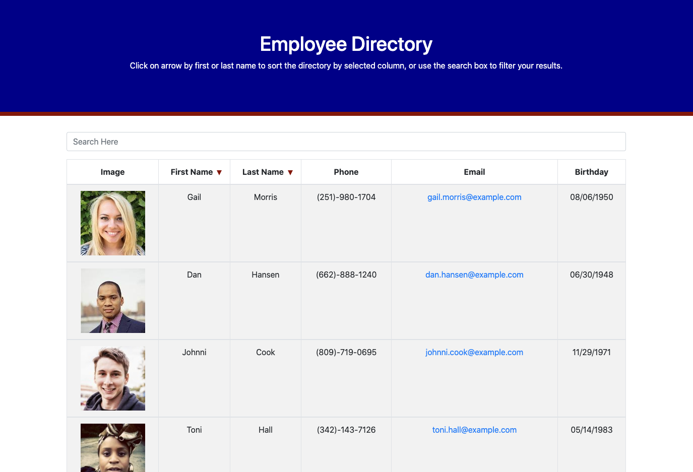

# 19_employee_directory

## Table of Contents

* [Description](#description)
* [Installation](#installation)
* [Usage](#usage)
* [License](#license)
* [Contributing](#contributing)
* [Tests](#tests)
* [Questions](#questions)

-----

## Description

This was a homework assignment where the challenge was to create an employee directory using React and an API to supply the random employee data [Random User Generator](https://randomuser.me/).

**Please Note:** This project was bootstrapped with [Create React App](https://github.com/facebook/create-react-app).

Example images:

-----

## Installation

This application is currently deployed, and it can be viewed at the following link:

* [Employee Directory](https://timothykemp.dev/19_employee_directory)

Those interested in installing this application should take the following steps:

1. Run the command `npm i` to ensure the correct Node Modules are installed prior to running the application.
2. Run the command `npm start` to start up the application on your local host.

-----

## Usage

Follow the prompts in the CLI to perform the following commands:

1. Click on the arrow by First Name to sort the list of employees by their first names.
2. Click on the arrow by Last Name to sort the list of employees by their last names.
3. Search for any string of alphabetical characters in order to automatically filter the list of employees to only those with those characters in their first OR last names.

-----

## License

This project does not have a license.

-----

## Contributing

This application was a homework assignment, and further contributions are not needed.

-----

## Tests

There are no specific tests provided for this application; however, in the event any issues are discovered, feel free to contact me using one of the methods below.

-----

## Questions

If you have any questions about this project, please free to contact me through my [Github profile](https://github.com/timothykemp) or via [email](mailto:timothymichaelkemp@gmail.com).
  